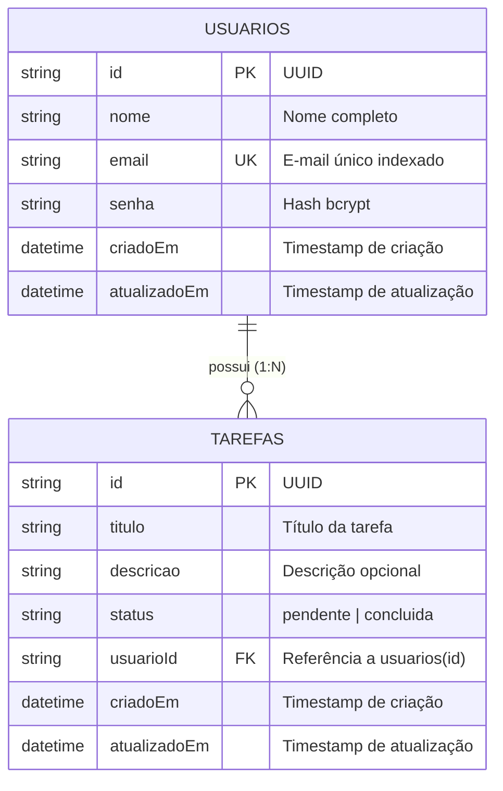
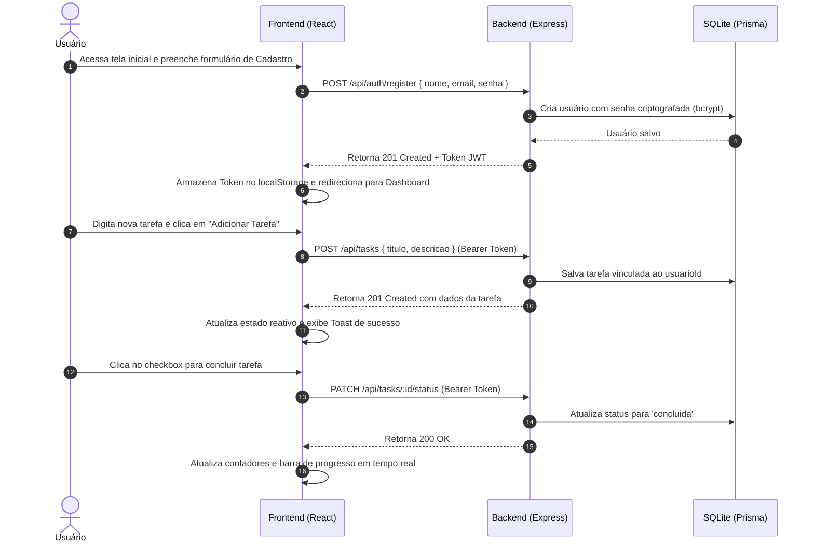

# 🚀 TaskFlow – Plataforma de Gerenciamento de Tarefas (Desafio Fullstack)

Aplicação web fullstack robusta, moderna e segura para gerenciamento de tarefas (*To-Do List*), contemplando banco de dados relacional, API RESTful autenticada em Node.js e interface interativa e responsiva em React.

---

## 📌 Sumário

1. [Descrição Geral](#-descrição-geral)
2. [Tecnologias Utilizadas](#-tecnologias-utilizadas)
3. [Estrutura de Pastas e Arquivos](#-estrutura-de-pastas-e-arquivos)
4. [Modelagem do Banco de Dados](#-modelagem-do-banco-de-dados)
5. [Endpoints da API & Funções Principais](#-endpoints-da-api--funções-principais)
6. [Segurança Aplicada](#-segurança-aplicada)
7. [Fluxo de Uso do Sistema](#-fluxo-de-uso-do-sistema)
8. [Instalação e Execução Local](#-instalação-e-execução-local)
9. [Bateria de Testes Automatizados](#-bateria-de-testes-automatizados)
10. [Declaração de Uso de Inteligência Artificial](#-declaração-de-uso-de-inteligência-artificial)

---

## 📖 Descrição Geral

O **TaskFlow** foi desenvolvido para solucionar a necessidade de organização diária de tarefas com foco em experiência do usuário (UX), desempenho e segurança de dados.

### Principais Recursos:
- **Autenticação Segura**: Cadastro e Login com emissão de tokens JWT e criptografia de senhas com *Bcrypt*.
- **Isolamento de Dados**: Cada usuário tem acesso estrito apenas às suas próprias tarefas.
- **CRUD Completo de Tarefas**: Criação, listagem, visualização, edição completa e exclusão segura.
- **Alternância Dinâmica de Status**: Marcar tarefas como pendentes ou concluídas com atualização em tempo real (*optimistic UI*).
- **Filtros e Busca Instantânea**: Filtragem por status (*Todas*, *Pendentes*, *Concluídas*) e busca por palavras-chave no título e na descrição.
- **Dashboard Produtivo**: Métricas dinâmicas de total de tarefas, contagem de pendências, concluídas e barra de porcentagem de progresso.
- **Design Moderno & Responsivo**: Suporte nativo a temas Claro/Escuro (*Dark Mode*), notificações via Toasts e interface fluida.

---

## 🛠️ Tecnologias Utilizadas

### Backend:
- **Node.js** (v20+ / ES Modules)
- **Express.js**: Framework HTTP para estruturação da API REST.
- **Prisma ORM**: Modelagem de dados, migrações e consultas parametrizadas tipadas.
- **SQLite**: Banco de dados relacional embutido e portátil.
- **JSON Web Token (`jsonwebtoken`)**: Autenticação stateless baseada em tokens Bearer.
- **Bcrypt.js**: Algoritmo de hashing seguro para senhas com salt rounds.
- **Zod**: Validação estrita de esquemas e sanitização de dados de entrada.
- **Helmet**: Middleware para configuração de headers HTTP seguros contra vulnerabilidades comuns.
- **CORS**: Controle de acesso entre origens.

### Frontend:
- **React.js 18**: Biblioteca para construção de interfaces reativas baseadas em componentes.
- **Vite**: Bundler e servidor de desenvolvimento ultra-rápido.
- **Lucide React**: Conjunto moderno e consistente de ícones vetoriais.
- **Vanilla CSS (Design Tokens)**: Estilização modular com CSS Variables, micro-animações, layout responsivo e alternador de tema sem dependência de bibliotecas externas pesadas.

---

## 📁 Estrutura de Pastas e Arquivos

```text
CESS-UFF/
├── backend/                         # Servidor e regras de negócio
│   ├── prisma/
│   │   ├── schema.prisma            # Modelagem das entidades Usuario e Tarefa
│   │   └── dev.db                   # Arquivo do banco SQLite (gerado automaticamente)
│   ├── src/
│   │   ├── controllers/
│   │   │   ├── authController.js    # Lógica de registro, login e perfil do usuário
│   │   │   └── taskController.js    # Lógica de CRUD, filtros, busca e estatísticas
│   │   ├── middlewares/
│   │   │   ├── authMiddleware.js    # Proteção de rotas com validação de token JWT
│   │   │   ├── errorMiddleware.js   # Interceptador global de erros da API
│   │   │   └── validationMiddleware.js # Validador de esquemas Zod (body, query, params)
│   │   ├── routes/
│   │   │   ├── authRoutes.js        # Definição das rotas públicas de autenticação
│   │   │   └── taskRoutes.js        # Definição das rotas protegidas de tarefas
│   │   ├── schemas/
│   │   │   ├── authSchema.js        # Regras de validação Zod para autenticação
│   │   │   └── taskSchema.js        # Regras de validação Zod para tarefas e filtros
│   │   ├── app.js                   # Configuração do Express, CORS e Helmet
│   │   ├── prisma.js                # Instância singleton do Prisma Client
│   │   └── server.js                # Inicialização e escuta da porta do servidor
│   ├── .env.example                 # Exemplo de variáveis de ambiente do backend
│   ├── .env                         # Variáveis de ambiente locais
│   └── package.json                 # Dependências e scripts do backend
│
├── frontend/                        # Interface web do usuário (SPA)
│   ├── src/
│   │   ├── components/
│   │   │   ├── EditTaskModal.jsx    # Modal de edição completa da tarefa
│   │   │   ├── Navbar.jsx           # Cabeçalho com dados do usuário, tema e logout
│   │   │   ├── StatsCard.jsx        # Cards de métricas e barra de progresso
│   │   │   ├── TaskCard.jsx         # Card individual com checkbox, edição e exclusão
│   │   │   ├── TaskFilter.jsx       # Abas de filtro por status e barra de busca
│   │   │   ├── TaskForm.jsx         # Formulário dinâmico para criação de tarefas
│   │   │   ├── TaskList.jsx         # Renderizador de lista e estado vazio elegante
│   │   │   └── Toast.jsx            # Notificações visuais flutuantes (sucesso/erro)
│   │   ├── contexts/
│   │   │   ├── AuthContext.jsx      # Gerenciamento global de autenticação e tema
│   │   │   └── TaskContext.jsx      # Estado e operações reativas das tarefas
│   │   ├── pages/
│   │   │   ├── AuthPage.jsx         # Tela unificada de Login e Registro
│   │   │   └── DashboardPage.jsx    # Painel principal do usuário autenticado
│   │   ├── services/
│   │   │   └── api.js               # Cliente HTTP com injeção automática de JWT
│   │   ├── styles/
│   │   │   ├── global.css           # Resets, layouts, cards e componentes base
│   │   │   └── tokens.css           # Variáveis CSS (cores, tipografia, temas)
│   │   ├── App.jsx                  # Roteador condicional autenticado
│   │   └── main.jsx                 # Ponto de montagem da árvore React
│   ├── index.html                   # HTML base com fontes Inter e Outfit
│   ├── vite.config.js               # Configuração do Vite
│   └── package.json                 # Dependências e scripts do frontend
│
├── .gitignore                       # Arquivos ignorados pelo controle de versão
├── package.json                     # Scripts raiz para execução integrada
├── README.md                        # Documentação completa do projeto
└── test-api.js                      # Bateria automatizada de testes E2E da API
```

---

## 🗄️ Modelagem do Banco de Dados

O banco de dados relacional SQLite foi estruturado com integridade referencial e deleção em cascata (*Cascade Delete*):



### Relacionamentos e Regras:
- **`usuarios`**: Tabela de usuários. Possui restrição de unicidade (`UNIQUE`) no campo `email`.
- **`tarefas`**: Tabela de tarefas associadas. O campo `usuarioId` é uma chave estrangeira referenciando `usuarios(id)`.
- Ao excluir um usuário, todas as suas tarefas vinculadas são automaticamente removidas via `onDelete: Cascade`.

---

## 📡 Endpoints da API & Funções Principais

### Base URL: `http://localhost:5000/api`

### 1. Rotas de Autenticação (`/auth`)

| Método | Rota | Descrição | Protegida? | Corpo / Parâmetros |
| :--- | :--- | :--- | :---: | :--- |
| `POST` | `/auth/register` | Cadastra novo usuário e gera token JWT | Não | `{ "nome": "string", "email": "string", "senha": "string (min 6)" }` |
| `POST` | `/auth/login` | Autentica usuário e retorna token JWT | Não | `{ "email": "string", "senha": "string" }` |
| `GET` | `/auth/me` | Retorna os dados do usuário autenticado | **Sim** | *Header: `Authorization: Bearer <token>`* |

### 2. Rotas de Tarefas (`/tasks`)
*Todas as rotas abaixo requerem o header `Authorization: Bearer <token>`.*

| Método | Rota | Descrição | Validações & Parâmetros |
| :--- | :--- | :--- | :--- |
| `GET` | `/tasks` | Lista tarefas do usuário com filtros e estatísticas | Query params opcionais: `?status=todas\|pendente\|concluida&search=termo` |
| `GET` | `/tasks/:id` | Retorna os detalhes de uma tarefa específica | Valida se a tarefa pertence ao usuário logado |
| `POST` | `/tasks` | Cria uma nova tarefa para o usuário | Body: `{ "titulo": "string", "descricao": "string?", "status": "pendente\|concluida" }` |
| `PUT` | `/tasks/:id` | Atualiza dados da tarefa | Body: `{ "titulo": "string?", "descricao": "string?", "status": "string?" }` |
| `PATCH` | `/tasks/:id/status` | Alterna status entre `pendente` e `concluida` | Ação rápida para checkboxes |
| `DELETE` | `/tasks/:id` | Exclui permanentemente a tarefa do usuário | Valida posse antes da exclusão |

### 3. Rota de Saúde (`/health`)
- `GET /api/health`: Verifica a disponibilidade do servidor e conexão com o banco.

---

## 🔒 Segurança Aplicada

1. **Hash Criptográfico de Senhas**:
   - Utilização de `bcryptjs` com **10 salt rounds**, garantindo que as senhas nunca sejam armazenadas em texto plano e sejam resistentes a ataques de dicionário e rainbow tables.
2. **Autenticação Stateless com JWT**:
   - Geração de tokens assinados com segredo digital seguro e tempo de expiração configurável.
   - O middleware `authMiddleware` valida a assinatura e autenticidade do token antes de permitir o acesso às rotas privadas.
3. **Isolamento Estrito de Dados (Multi-tenant)**:
   - Todas as operações no banco de dados utilizam o `usuarioId` extraído diretamente do token validado, impedindo que um usuário visualize, edite ou delete tarefas de outros usuários.
4. **Proteção contra SQL Injection**:
   - O **Prisma ORM** utiliza *Prepared Statements* e consultas parametrizadas internamente em todas as operações de banco de dados.
5. **Validação e Sanitização de Entrada**:
   - Esquemas rigorosos com **Zod** validam tipos, formatos (e-mails válidos, limites de caracteres e enums de status), rejeitando payloads maliciosos com código HTTP `400 Bad Request`.
6. **Proteção contra XSS e Headers de Segurança**:
   - O **Helmet** injeta cabeçalhos de proteção (como `X-Content-Type-Options`, `X-Frame-Options`, `Content-Security-Policy`).
   - O React realiza escape automático de valores renderizados no DOM, prevenindo injeções de scripts maliciosos.
7. **Tratamento Centralizado de Erros**:
   - Middleware `errorMiddleware` captura exceções e previne vazamento de stack traces detalhados para clientes em produção.

---

## 🔄 Fluxo de Uso do Sistema



---

## 💻 Instalação e Execução Local

### Pré-requisitos
- **Node.js** (versão 18 ou superior)
- **npm** (versão 9 ou superior)

### 1. Clonar o Repositório
```bash
git clone <URL_DO_REPOSITORIO>
cd CESS-UFF
```

### 2. Instalação e Configuração Automatizada
Você pode instalar todas as dependências do backend e frontend com o comando:
```bash
npm run install:all
```

*(Ou instale manualmente em cada pasta:)*
```bash
# No diretório backend
cd backend
npm install
npx prisma generate
npx prisma db push
cd ..

# No diretório frontend
cd frontend
npm install
cd ..
```

### 3. Configuração de Variáveis de Ambiente
O backend já inclui um arquivo `.env` configurado por padrão. Caso queira customizar, copie o `.env.example`:
```bash
# No diretório backend
cp .env.example .env
```

### 4. Executando o Projeto

Abra dois terminais (um para o backend e outro para o frontend) ou use os comandos na raiz:

#### Terminal 1 – Backend:
```bash
npm run dev:backend
# Servidor rodará em: http://localhost:5000
```

#### Terminal 2 – Frontend:
```bash
npm run dev:frontend
# Aplicação estará acessível em: http://localhost:5173
```

---

## 🧪 Bateria de Testes Automatizados

O projeto inclui um script completo de testes ponta a ponta que valida:
- Endpoint de healthcheck.
- Cadastro de usuário e geração de token.
- Rejeição de e-mail duplicado (409 Conflict).
- Validação de regras de senha com Zod (400 Bad Request).
- Login com credenciais válidas e inválidas.
- Acesso à rota protegida `/auth/me`.
- Bloqueio de acesso não autenticado (401 Unauthorized).
- Criação, listagem, filtros por status, busca por texto, alternância de status e atualização de tarefas.
- **Isolamento de dados multi-tenant** (garantia de que o Usuário 2 não tem acesso às tarefas do Usuário 1).
- Exclusão segura de tarefas.

Para executar a bateria de testes:
```bash
npm run test:api
```

Resultado esperado:
```text
🧪 Iniciando Bateria de Testes Automatizados da API...
  ✅ [PASS] Endpoint de Healthcheck responde 200 OK
  ✅ [PASS] Status da API é success
  ✅ [PASS] Cadastro de novo usuário retorna 201 Created
  ✅ [PASS] Token JWT retornado no cadastro
  ✅ [PASS] Cadastro com e-mail duplicado rejeitado com 409 Conflict
  ✅ [PASS] Senha menor que 6 dígitos rejeitada com 400 Bad Request
  ✅ [PASS] Login com credenciais corretas retorna 200 OK
  ✅ [PASS] Dados do usuário retornados no login
  ✅ [PASS] Login com senha incorreta retorna 401 Unauthorized
  ✅ [PASS] Rota /api/auth/me autenticada retorna 200 OK
  ✅ [PASS] Nome do usuário autenticado confere
  ✅ [PASS] Listagem de tarefas sem token rejeitada com 401 Unauthorized
  ✅ [PASS] Criação de tarefa 1 retorna 201 Created
  ✅ [PASS] Criação de tarefa 2 retorna 201 Created
  ✅ [PASS] Listagem de tarefas retorna 200 OK
  ✅ [PASS] Usuário 1 possui 2 tarefas cadastradas
  ✅ [PASS] Estatística total confere (2)
  ✅ [PASS] Estatística pendentes confere (1)
  ✅ [PASS] Estatística concluídas confere (1)
  ✅ [PASS] Taxa de conclusão calculada corretamente (50%)
  ✅ [PASS] Filtro status=concluida retorna 1 tarefa
  ✅ [PASS] Tarefa concluída filtrada corretamente
  ✅ [PASS] Busca por "Testes" retorna 1 tarefa correspondente
  ✅ [PASS] Alternância rápida de status retorna 200 OK
  ✅ [PASS] Status alternado com sucesso para concluida
  ✅ [PASS] Atualização de tarefa retorna 200 OK
  ✅ [PASS] Título atualizado
  ✅ [PASS] Usuário 2 recém-criado possui 0 tarefas (isolamento OK)
  ✅ [PASS] Tentativa de Usuário 2 deletar tarefa de Usuário 1 bloqueada com 404 Not Found
  ✅ [PASS] Usuário 1 deleta sua própria tarefa com sucesso (200 OK)
  ✅ [PASS] Lista do Usuário 1 agora contém apenas 1 tarefa

========================================
🎉 Bateria Concluída: 31 PASSADOS | 0 FALHADOS
========================================
```

---

## 🤖 Declaração de Uso de Inteligência Artificial

*Em conformidade com as diretrizes do edital de avaliação do desafio fullstack:*

Durante o desenvolvimento deste projeto, foram utilizadas ferramentas de Inteligência Artificial (especificamente o assistente **Antigravity / Gemini**) com as seguintes finalidades:
1. **Auxílio na estruturação inicial de arquivos e boilerplate** para agilizar a criação dos módulos backend e componentes React.
2. **Elaboração da bateria de testes automatizados (`test-api.js`)** para validação exaustiva de todos os fluxos de sucesso e casos de borda (injeção, e-mails duplicados, isolamento entre contas).
3. **Refinamento da documentação técnica e diagramas Mermaid**, garantindo conformidade com todos os tópicos obrigatórios de entrega.

Todo o código, arquitetura, regras de segurança e integração foram minuciosamente analisados, revisados e validados para assegurar total domínio técnico sobre a solução entregue.
